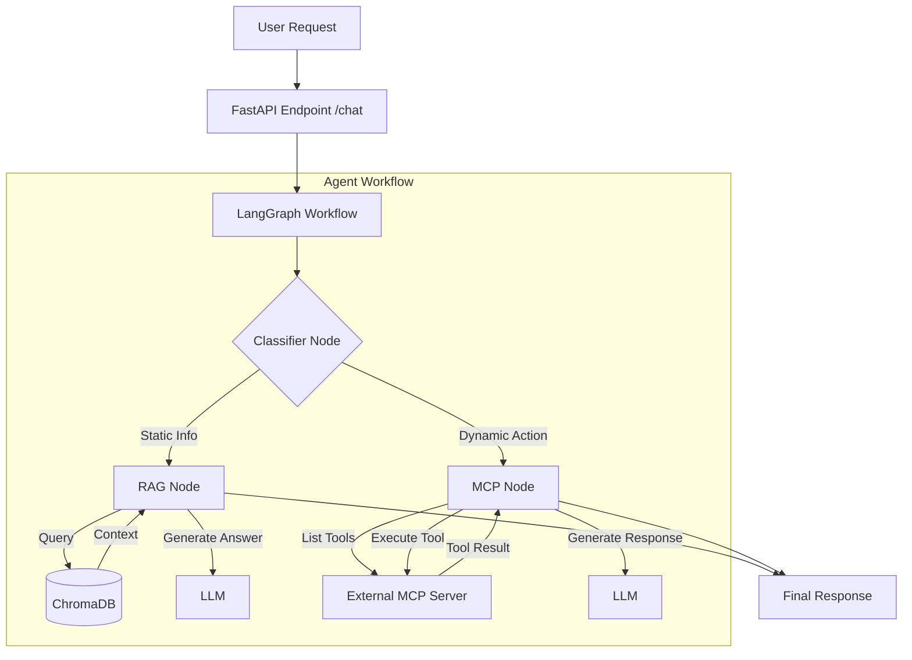

# LangGraph RAG MCP Agent

A FastAPI-based intelligent agent that routes user queries to either a Retrieval-Augmented Generation (RAG) system for static information or a Model Context Protocol (MCP) client for dynamic tool execution and actions.

## Overview

This project implements a routing agent using LangGraph. It intelligently classifies user intent and directs requests to the appropriate handler:

- **RAG Node**: Handles questions about policies, fees, and static documentation by retrieving relevant context from a PDF.
- **MCP Node**: Handles action-oriented requests (e.g., checking balances, transfers) by interacting with an external MCP server.

## Technical Architecture

The system is built on a modular architecture orchestrating three main components:

1. **FastAPI Entry Point (`main.py`)**:
    - Host the application using `uvicorn`.
    - Manages the application lifecycle (startup/shutdown events).
    - Initializes the `checkpoints.sqlite` database for LangGraph state persistence.
    - Exposes the POST `/chat` endpoint which accepts a `question` and `thread_id`.

2. **LangGraph Controller (`graph.py`)**:
    - **State Management**: Uses `AgentState` (TypedDict) to track `messages`, `context`, and `classification`.
    - **Workflow Nodes**:
        - **Classifier Node**: Uses an LLM (via OpenRouter) with a specialized prompt to classify user intent into "rag" (informational) or "mcp" (actionable).
        - **RAG Node**: Queries the vector store and synthesizes an answer using the LLM.
        - **MCP Node**: Connects to the external MCP server, lists available tools, binds them to the LLM, and executes tools in a loop until the task is complete.
    - **Routing**: Conditional edges based on the classification result steer the flow to either the RAG or MCP node.

3. **MCP Client (`mcp_client.py`)**:
    - Implements a standard `MCPClient` class.
    - **Connection**: Establishes a stdio connection to the subprocess specified by `MCP_SERVER_COMMAND` and `MCP_SERVER_ARGS`.
    - **Tool Discovery**: Dynamically lists tools from the connected server.
    - **Execution**: Converts MCP tool definitions into LangChain `StructuredTool` objects, allowing the LLM to invoke them directly.

4. **RAG System (`rag.py`)**:
    - **Ingestion**: Loads a PDF, splits it into chunks (RecursiveCharacterTextSplitter), and embeds them using Ollama (`nomic-embed-text`).
    - **Storage**: Persists embeddings in a local `chroma_db` directory.
    - **Retrieval**: Uses semantic search to find relevant document chunks for a given query.

### Data Flow



## Tech Stack

- **Backend Framework**: FastAPI
- **Orchestration**: LangGraph, LangChain
- **Vector Database**: ChromaDB
- **Embeddings**: Ollama (`nomic-embed-text`)
- **LLM Provider**: OpenRouter (supporting models like GPT-4, Claude 3, Llama 3)
- **Tool Communication**: Model Context Protocol (MCP) Python SDK
- **Environment Management**: Python-dotenv

## Prerequisites

- Python 3.10+
- [Ollama](https://ollama.com/) running locally with the `nomic-embed-text` model:

  ```bash
  ollama pull nomic-embed-text
  ```

- An MCP Server (e.g., a banking server or brave search server) to connect to.
  - The `ProcomBackendMCP` server is included in this repo.
  - Ensure the backend API is running locally at `https://localhost:8000/api/v1`.
- `uv` (recommended for running the MCP server efficiently).

## Installation

1. Clone the repository.
2. Create and activate a virtual environment.
3. Install dependencies:

   ```bash
   pip install -r requirements.txt
   ```

## Configuration

Create a `.env` file in the root directory with the following variables:

```ini
# API Keys
OPENROUTER_API_KEY=your_openrouter_key

# RAG Configuration
PDF_FILE_PATH=path/to/your/document.pdf
OLLAMA_BASE_URL=http://localhost:11434

# MCP Server Configuration
# Example for a Python-based MCP server running with uv
MCP_SERVER_COMMAND=uv
MCP_SERVER_ARGS=["run", "ProcomBackendMCP/server.py"]
```

## Usage

### 1. Start the Server

Run the application using the included runner or uvicorn directly:

```bash
python main.py
```

Or using uvicorn:

```bash
uvicorn main:app --reload --host 0.0.0.0 --port 8001
```

### 2. API Endpoint

**Endpoint**: `POST /chat`

**Description**: Main interaction endpoint for the agent.

**Payload**:

```json
{
  "question": "What are the credit card annual fees?",
  "thread_id": "user_session_123"
}
```

**Response**:

```json
{
  "answer": "The annual fee for the Gold Credit Card is PKR 5,000.",
  "classification": "rag"
}
```

## Project Structure

- `main.py`: Application entry point, API definition, and lifecycle management.
- `graph.py`: Defines the LangGraph workflow, nodes (Classifier, RAG, MCP), and conditional routing logic.
- `rag.py`: Handles document ingestion, vector store management (ChromaDB), and retrieval logic.
- `mcp_client.py`: Implements the generic Model Context Protocol client for tool discovery and execution.
- `logger.py`: Interaction logging utility.
